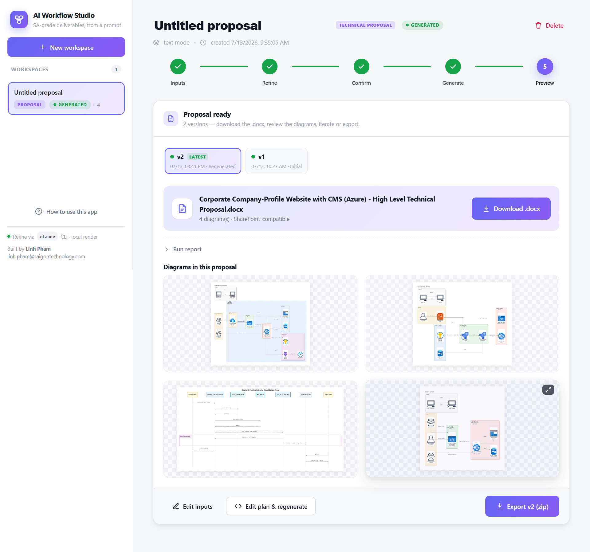

# AI Workflow Studio

A monorepo of reusable Claude Code skills plus a shared local web app ("AI Workflow
Studio") that drives them. Each skill lives in its own folder and deploys independently
(a junction/symlink from every local Claude profile to the skill source, so editing in
the repo updates every profile immediately).



*AI Workflow Studio — the shared web app: pick a workspace type (diagram, technical proposal, or WBS + cost), refine, confirm at a gate, generate, keep version history, and export.*

## Install — one command, nothing else needed

**Windows** (PowerShell):

```powershell
irm https://raw.githubusercontent.com/linhphamSTS/AI-Workflow-Studio/main/get.ps1 | iex
```

**macOS / Linux:**

```bash
curl -fsSL https://raw.githubusercontent.com/linhphamSTS/AI-Workflow-Studio/main/get.sh | bash
```

That is the whole thing. It downloads the repo, **fetches a private Python if the machine
has none** (through `uv`, into `uv`'s own directory, leaving any system Python alone),
builds the web app's virtual-env, installs the dependencies, gets Graphviz, deploys every
skill into every Claude Code profile, offers to install the Claude Code CLI when it is
missing, puts an **AI Workflow Studio** icon on your Desktop, and adds an `aiws` command.
No Administrator or `sudo`, nothing installed system-wide. Budget a few minutes and about
200 MB on a first run.

**The one step that cannot be automated is signing in**, because it opens a browser. If you
are not signed in, the installer stops and prints `claude auth login`, and the web app shows
the same thing with a Copy button and a re-check.

Then start it from the **Desktop icon**, or run `aiws` in a terminal (→ http://127.0.0.1:8000).

Re-running the installer updates an existing install in place. Your workspaces are never
touched.

<details>
<summary>Already have the repo cloned?</summary>

`install.py` does everything except downloading: deploys every skill and prepares the web
app. It needs Python 3.10+ to already be present.

- **Windows:** double-click **`install.bat`** (or `py -3 install.py`)
- **macOS / Linux:** `./install.sh` (or `python3 install.py`)

Start the app with **`run.bat`** / `./run.sh`.
</details>

Skills also work directly in any Claude Code session: `/linhpham-diagram`,
`/linhpham-technicalproposal` and `/linhpham-wbs`.

## Skills

### `technical-proposal/` — `/linhpham-technicalproposal`
Turns a project folder (RFP + supporting docs) into a SharePoint-compatible
High-Level Technical Proposal `.docx` with senior-SA-grade architecture diagrams:
ingest → analyze → confirm gate → generate (parallel agents) → assemble →
strict format review → report.

Deploy: `cd technical-proposal && python tools/deploy.py`

### `diagram/` — `/linhpham-diagram`
Turns a plain-language description (or a folder of project docs) into a
senior-SA-grade diagram (sharp PNG + editable `.drawio` + `.docx`).

Deploy: `cd diagram && python tools/deploy.py`

### `wbs-estimate/` — `/linhpham-wbs`
Turns a folder of bid documents into a Work Breakdown Structure with man-hour
estimates, plus a cloud cost estimation workbook where infrastructure is in scope.
Fills a client-supplied WBS without touching its structure, or authors the breakdown
from an RFP, detecting which on its own: ingest → analyze → confirm gate → estimate
with an explicit factor layer → build → verify → report. The gate proves requirement
coverage and refuses a workbook that would render clipped on SharePoint.

Deploy: `cd wbs-estimate && python tools/deploy.py`

### `webapp/` — the shared web app ("AI Workflow Studio")
A local browser UI over the skills. When you create a workspace you pick its type
(**diagram**, **technical proposal**, or **WBS + cost** — which also asks whether to fill
a client-supplied WBS or author one), then: refine/analyze → confirm at a gate →
generate → version history/compare → export. It drives the skills head-less via the
`claude` CLI, and sits at the top level (beside them) so a new skill plugs into the
same UI.

Run: `python webapp/launch.py` (or `webapp/run.bat` / `webapp/run.sh`) → http://127.0.0.1:8000

## How it learns (gets smarter over time)

Every skill here **self-improves after each run** — not by swapping in a bigger model, but by
turning each mistake into a rule that is enforced automatically the next time.

**The mechanism (each skill owns it):**

1. **Diary.** Every skill keeps a `LESSONS_LEARNED.md` — a running log of what went wrong,
   what a client flagged, or a non-obvious gotcha, each with its concrete fix.
2. **Promote, don't just log.** A lesson only makes the skill smarter if it is *applied* next
   time, so every reusable lesson is **promoted** into the place that actually runs — a prompt,
   a knowledge-base note, a renderer script, or a build-time guard. Once promoted, the correct
   behaviour happens on its own and the skill physically cannot repeat that mistake.
3. **Read at the start.** Each run loads those enforced rules (they apply automatically) and
   skims the diary for anything relevant to the current job.

**Where the learning runs**

- **Technical proposal** — the skill's final phase appends a lesson and promotes the rule.
- **Diagram** — after a render, a short self-check reviews the output against the skill's own
  senior-SA quality rubric and records/promotes anything reusable.
- **WBS + cost** — the reporting phase records what the estimate got wrong and what the verifier
  had to catch, so the next estimate starts from real figures rather than from ranges.
- **Web app** — it never writes lessons itself; it only lets each skill run its *own*
  self-learning. Learning always happens **through the skill**, so the skill (not some separate
  store) is what gets smarter — on every machine the repo is deployed to.

**Why the log never slows it down.** `LESSONS_LEARNED.md` is a *diary*: it may grow freely. The
skill's real memory is the promoted rules living in its prompts/scripts, which cost nothing extra
to apply. So the archive of lessons can keep growing without ever making a run slower or less
accurate — the intelligence is in the enforced rules, not in re-reading the log.

**Real examples of promoted lessons** (each now enforced, so it can't recur):

- template images placed in a *Heading* paragraph leaked into the SharePoint Table of Contents →
  a build-time guard now fails the build if any template image sits in a heading;
- a full-page cover image overflowed onto a blank extra page on SharePoint → full-page images are
  now floating (behind text) instead of inline;
- diagrams could embed soft/blurry in Word → the renderers now guarantee ≥ 300 DPI at the
  6.5-inch Word embed width.

## Layout

```
.
├─ technical-proposal/   # /linhpham-technicalproposal skill + tools + templates
├─ diagram/              # /linhpham-diagram skill + tools
├─ wbs-estimate/         # /linhpham-wbs skill + tools
├─ webapp/               # "AI Workflow Studio" — shared local web app over the skills
└─ tools/                # repo-wide: the parity gate, the installer test, the icon source
```

`get.ps1` / `get.sh` at the root are the one-command installers above. `tools/test_install.ps1`
exercises one end to end inside a throwaway HOME and a throwaway Claude profile, then proves
the real profiles were left alone; `tools/make_icon.py` regenerates the Desktop icon from the
app's brand mark, deterministically, so the committed `.ico` is not an opaque binary.

Each skill folder keeps its own `deploy.*`, `.gitignore`, and `LESSONS_LEARNED.md`,
so the skills stay fully independent inside one repository.

`tools/check_skill_parity.py` guards the boundary between them: skills that draw diagrams
share their rendering scripts byte for byte, and the gate fails if an edit lands on one
side only. That is not hypothetical — it happened, and for a day one skill drew worse
arrows than the other with nothing to say so.
